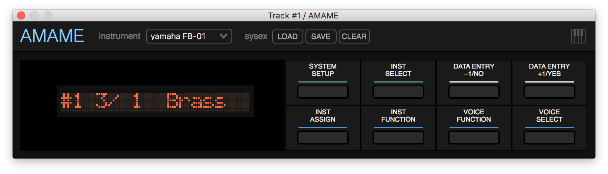
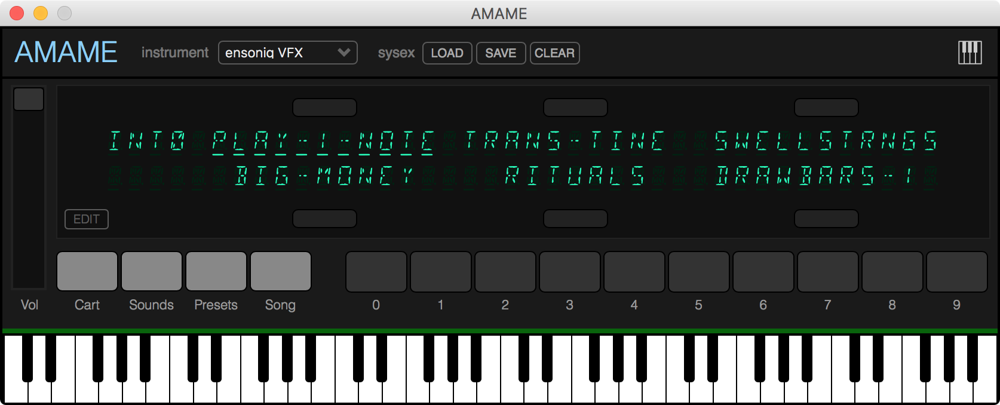
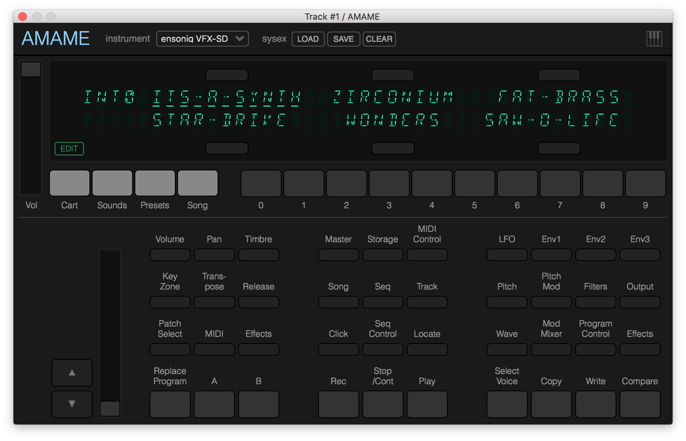

# AMAME #

Forked from [MAME](https://github.com/mamedev/mame)

This WIP project builds on hardware synthesizer emulations available in MAME. **AMAME** fork provides a custom osd to run the synth emulations as VST2 plugins, with an embedded webview to host the GUIs. Custom front panels are implemented using web technologies. AMAME also provides a tiny frontend to enable device hot swapping, sysex import and export, and virtual midi keyboard.

The plugins are quite CPU intensive because the emulations strive towards sample accurate preservations of their hardware counterparts. Full polyphony takes 30-40% of single CPU core, but the synths sound great. The emulations require original ROM images from the synths. This project will not provide ROMs.

Currently emulated devices are:

manufacturer|model|year
---|---|---
Ensoniq|VFX|1989
Ensoniq|VFX-SD|1989
Yamaha|FB-01|1986

Project sources and MAME related design discussion is [here](projects/amame)

## screenshots ##

from Bitwig (2.3.4 demo) and ImageLine Minihost Modular (1.5.7), macOS High Sierra

## credits ##
* jariseon : AMAME osd, frontend, vst2 plugin and GUIs
* cbrunschen : MAME vfx panel, partly reused here
* edstrom : inspiration for XSLT layout file conversion
* [MAME team](http://mamedev.org) : emulations
* [michaeltyson](https://github.com/michaeltyson/TPCircularBuffer) : circular buffer
* [stuartmemo](https://github.com/stuartmemo/qwerty-hancock) : soft keyboard
* [onlinewebfonts](https://www.onlinewebfonts.com/icon/) : keyboard icon